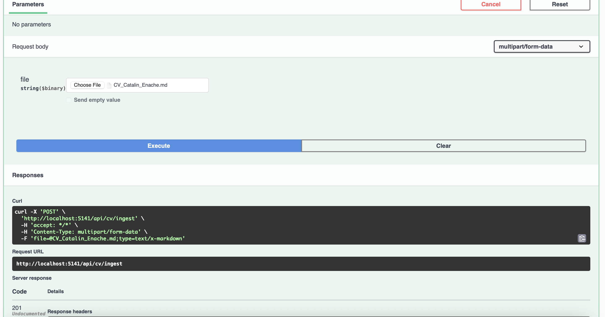
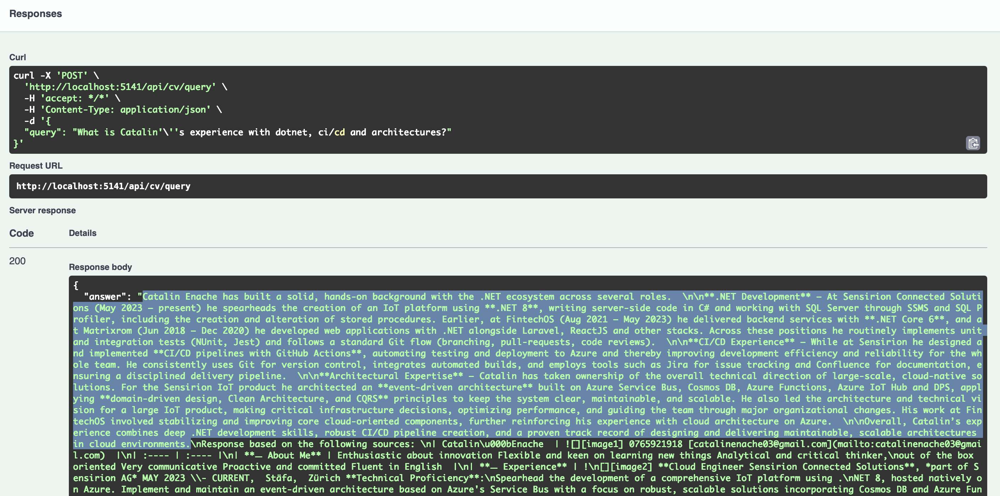

# CV Bot - RAG Demo with Semantic Kernel

A simple CV assistant that answers questions about uploaded resumes using Retrieval Augmented Generation (RAG) and Semantic Kernel.

## Overview

This project demonstrates a clean approach to building AI-powered applications in .NET 8. Upload a CV, ask questions about it, and get contextual answers backed by the actual content.

## Key Features

- **CV Ingestion**: Upload a CV file that gets chunked and stored with embeddings
- **Semantic Search**: Find relevant CV sections based on natural language queries  
- **Zero-Shot Answers**: Each query is independent (no conversation history or multi-turn dialogue)
- **Contextual Responses**: All answers are grounded in the actual CV content

## Architecture & Patterns

The project showcases several software engineering practices:

- **Clean Architecture**: Clear separation between Domain, Application, Infrastructure, and Web API layers
- **Domain-Driven Design**: Core business logic lives in the domain with no external dependencies
- **CQRS with MediatR**: Commands and queries for clear separation of concerns
- **Screaming Architecture**: Feature-based folder structure (CvIngestion, CvExploration, etc.)
- **Functional Error Handling**: Using Result pattern instead of exceptions for expected failures
- **Dependency Injection**: Proper service registration with appropriate lifetimes

## Tech Stack

- **.NET 8** with minimal APIs
- **Semantic Kernel** for AI orchestration
- **Microsoft.Extensions.AI** for embeddings and vector operations
- **In-Memory Vector Store** for semantic search
- **Ollama/Groq/Azure OpenAI** support for LLMs
- **MediatR** for CQRS implementation
- **Swagger** for API documentation

## Getting Started

### Prerequisites

- .NET 8 SDK
- Ollama running locally (or configure other providers in appsettings.json)

### Running the Application

```bash
dotnet run --project CVBot.WebApi
```

Navigate to `https://localhost:5001/swagger` to access the API documentation.

### API Endpoints

#### 1. Ingest CV
**POST** `/api/cv/ingest`

Upload a CV file to be processed and stored.



#### 2. Query CV
**POST** `/api/cv/query`

Ask questions about the uploaded CV. Each query is independent (there's no conversation history).

```json
{
  "query": "What is this person's experience with .NET?"
}
```



## Configuration

Configure AI models in `appsettings.json`:

```json
{
  "AiConfig": {
    "ReasoningAiModel": {
      "Provider": "Ollama",
      "ModelName": "llama3.2",
      "Endpoint": "http://localhost:11434"
    },
    "EmbeddingAiModel": {
      "Provider": "Ollama", 
      "ModelName": "nomic-embed-text",
      "Endpoint": "http://localhost:11434",
      "EmbeddingsDimension": 768
    }
  }
}
```

## Project Structure

```
CVBot/
├── CVBot.Domain/           # Core business logic
│   ├── CvAssistant.cs     # Main domain service
│   └── CvContext/         # Context retrieval interfaces
├── CVBot.Application/      # Use cases and orchestration
│   ├── CvIngestion/       # CV upload commands
│   └── CvExploration/     # Query handlers
├── CVBot.Infrastructure/   # External concerns
│   ├── Intelligence/      # AI model implementations
│   ├── CvStorage/         # Vector store repository
│   └── CvRetrieval/       # Semantic search
└── CVBot.WebApi/          # HTTP endpoints
    └── Controllers/       # API controllers
```

## How It Works

1. **Ingestion**: CV text is chunked into paragraphs, converted to embeddings, and stored in a vector database
2. **Query Processing**: Each query is processed independently (zero-shot), user queries are embedded and used to find semantically similar CV sections
3. **Answer Generation**: An LLM generates responses using only the retrieved context, ensuring factual answers without any conversation memory

## Design Decisions

- **In-Memory Vector Store**: Simple for demos, easily swappable with production stores (Qdrant, Pinecone, etc.)
- **Transient Services**: Compatible with MediatR's default handler lifetime
- **Result Pattern**: Explicit error handling without throwing exceptions
- **Primary Constructors**: Modern C# 12 syntax for cleaner dependency injection

## License

MIT